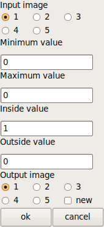
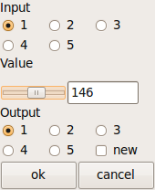

Description de l'interface graphique d'une fonction
===================================================

Les fonctions présentes dans le menu de MediPy vont avoir une interface 
graphique associée. L'ensemble des boîtes de dialogue de Medimax 3 (créees par 
les macros GET_INT, GET_FLOAT, GET_QCM, ...) sont ici remplacées par une unique
interface graphique.

Cette interface est décrite dans la docstring des fonctions python, selon la 
syntaxe précisée ci-dessous. Pour une fonction de seuillage prenant comme 
paramètres une image d'entrée, les bornes du seuillage et une image de sortie, 
on obtiendra l'interface suivante :

Syntaxe
-------

La syntaxe à utiliser dans la docstring de la fonction une syntax XML simple.
L'interface graphique est contenue dans un élément ``gui``, et chaque élément
de l'interface est décrit par un élément ``item`` avec les attributs suivants

* ``name`` : nom du paramètre correspondant de la fonction
* ``type`` : type du contrôle relié à ce paramètre
* ``initializer`` (optionnel) : paramètre d'initialisation du contrôle
* ``role`` (optionnel) : rôle du paramètre (vide, ``output`` ou ``return``)
* ``label`` : label associé
* ``tooltip`` (optionnel) : tooltip associé

L'attribut ``role`` sera absent si le paramètre concerné n'est pas modifié par
la fonction. Il vaudra ``output`` s'il est modifié par la fonction (i.e. c'est
un paramètre de sortie) ; il vaudra enfin ``return`` s'il s'agit d'une des
valeurs de retour de la fonction.

Exemples
^^^^^^^^

Des exemples valant mieux qu'un long discours, voici l'exemple d'une fonction de
seuillage : ::

    def binary_threshold(input=None, min=None, max=None, inside=None, outside=None) :
        """ Return a binarized version of the input image.
        
            <gui> 
                <item name="input" type="Image" label="Image"/>
                <item name="min" type="Float" label="Minimum value"
                    tooltip="Minimum value in threshold (included)"/>
                <item name="max" type="Float" label="Maximum value"
                    tooltip="Maximum value in threshold (included)"/>
                <item name="inside" type="Float" initializer="1" label="Inside value"
                    tooltip="Value taken by pixels inside the image"/>
                <item name="outside" type="Float" initializer="0" label="Outside value"
                    tooltip="Value taken by pixels outside the image"/>
                <item name="output" type="Image" initializer="output=True"
                    role="return" label="Output image"/>
            </gui>
        """
        
        pass

Le champ ``input`` crée un contrôle de type ``Image``, qui va permettre de
choisir entre plusieurs images grâce à des radio-buttons. Les champs ``min`` et 
``max`` ont une syntaxe similaire, mais ajoutent un tooltip. L'interface générée
est la suivante : 

La fonction suivante montre l'utilisation du paramètre d'initialisation du
contrôle : ::

    def erode(input, erode_value, *args, **kwargs):
        """ Binary dilation of an image using a name of a structuring element and a
            radius, or a structuring element.
            
            <gui>
                <item name="input" type="Image" label="Input"/>
                <item name="erode_value" type="Float" initializer="1" label="Erode value"/>
                <item name="shape" type="Enum" initializer="('ball', 'box','cross')"
                    label="Shape"/>
                <item name="radius" type="Int" initializer="1" label="Radius"/>
                <item name="output" type="Image" initializer="output=True" role="return"
                    label="Output"/>
            </gui>
        """
        
        pass

Le paramètre d'initialisation de ``radius`` est optionnel : un contrôle de type
``int`` peut être initialisé sans paramètre, mais on souhaite un élément
structurant de taille au moins 1. Le paramètre d'initialisation de ``shape`` est en
revanche obligatoire : on ne peut pas initialiser une liste de choix sans lui
donner la liste des valeurs qu'elle peut prendre. L'interface générée par cette
docstring est la suivante : 

.. image:: binary_erosion.png

On peut également spécifier un intervalle pour les valeurs prises pour un
contrôle de type ``Int`` grâce au paramètre ``range``. A la création de 
l'interface graphique, si le paramètre ``range`` est renseigné, on ajoute alors
une barre de défilement au contrôle. En règle générale, on peut également
choisir de stocker le résultat du traitement dans une nouvelle image en cochant
le bouton ``new`` du paramètre ``Output`` de l'interface graphique. On peut
également spécifier l'intervalle en fonction d'un des autres éléments de
l'interface graphique comme dans l'exemple ci dessous : ::

    def something(input, value, output) :
        """ Do something
            <gui>
                <item name="input" type="Image" label="Input"/>
                <item name="value" type="Int" 
                    initializer="range = (${input}.data.min(), ${input}.data.max())"
                    label="Value"/>
                <item name="output" type="Image" role="output" 
                    initializer="output = True" label="Output"/>
            </gui>
        """
    
        pass

